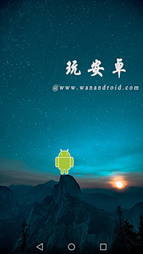
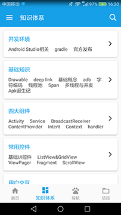
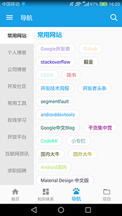
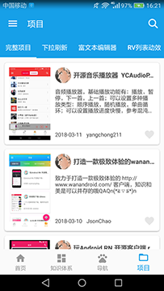
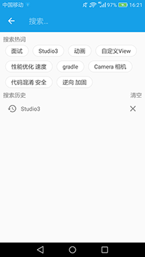

# WanAndroid

## 1.项目说明

此项目为鸿洋大神WanAndroid网站[www.wanandroid.com](http://www.wanandroid.com/)安卓版，采用Java编写。感谢洋神提供的API接口，项目采用MVP+Retrofit+RxJava框架，页面风格基于Material Design。

作为MVP结构的练手项目，目前还不完善，存在一些小问题，后面有时间会不断修改。

## 2.Apk下载##

[点击下载](https://github.com/StephenZKCurry/WanAndroid/tree/master/app/release/app-release.apk)

## 3.功能描述

**登录、注册**

**首页轮播图、文章列表、常用网站**

**知识体系下的文章** 

**常用网站、博客导航** 

**优秀开源项目**

**收藏文章、项目**

**站外网站添加书签** 

**文章搜索及历史记录**

**切换夜间模式**

## 4.相关技术

**MVP+Retrofit+RxJava**

**Material Design**

**Glide**

**BaseRecyclerViewAdapterHelper**

**GreenDao**

**FlowLayout**

**Bugly异常上报**

## 5.项目截图##

 

 

 

## 6.参考项目

**开源WanAndroid客户端 Java版本** <https://github.com/salecoding/WanAndroid>

**一之** [https://github.com/Horrarndoo/YiZhi](https://link.jianshu.com/?t=https://github.com/Horrarndoo/YiZhi)

感谢这些开源项目的作者